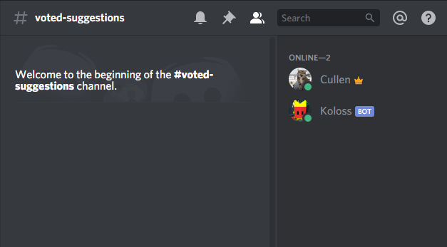

# Koloss-bot

Koloss-bot is a basic discord bot that reacts to every message in specified channels with set emojis. This bot was made by following [this guide](https://www.sitepoint.com/discord-bot-node-js/) and you'll probably want to follow the start of that too if you're looking to use this for your own bot.



## Installation

Create a .env file at the root with your bot's token.

```
TOKEN=my-unique-bot-token
```

Then just install as usual.

```
npm install
```

## Usage

Edit the react functions in index.js with your own emoji's unicode equivalent. For default emojis, you can simply escape them with a backslash, send the message, and then copy and paste that.

```
\:heart:
❤️
```

For custom emojis it's a similar process except you only care about the id number you get from escaping it.

```
\:greentick:
<:greentick:662386640185983027>
```
